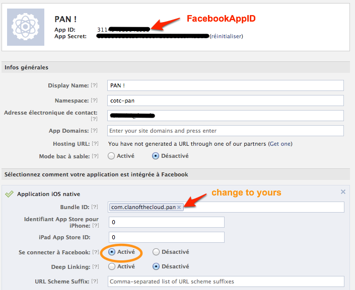
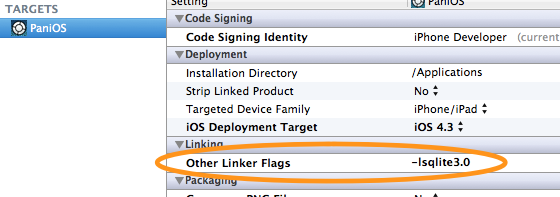
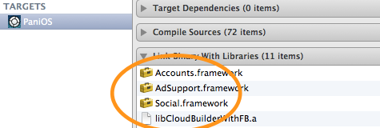
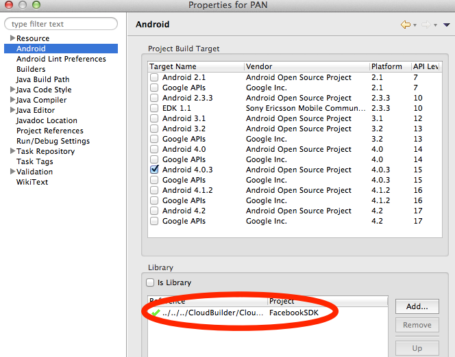

Facebook {#facebook_ref}
========

## Table of Content

1. [Facebook Developer](#toc1)
2. [Facebook on iOS](#toc2)
3. [Facebook on Android](#toc3)

# Setup a Facebook App {#toc1}

To be able to log in CloudBuilder with the user's facebook account, you need to create a [Facebook App](http://developers.facebook.com/)

On Facebook Developer website, check the following settings :

# Facebook on iOS {#toc2}

1. Link with sqlite, add it in th eBuild Settings pane :
    
2. Add the required framworks for FacebookSDK (Accounts, Social and AdSupport) :
 
3. In the Info-plist, setup the FacebookAppID and the URLSchemes
(the URLSchemes is the FacebookAppID prepend whith "fb") :
 

# Facebook on Android {#toc3}

- Setup the Android pane on facebook developer site
 
The Key Hashes is related to the dev enviroment, launch the following command to get it :
~~~
keytool -exportcert -alias androiddebugkey -keystore ~/.android/debug.keystore | openssl sha1 -binary | openssl base64
~~~

- Add the folowwing entries in the `AndroidManifest.xml`
~~~
<meta-data android:value="@string/app_id" android:name="com.facebook.sdk.ApplicationId"/>
<activity android:name="com.facebook.LoginActivity"></activity>
~~~

- Put the facebooID in the `strings.xml`
~~~
<string name="app_id">311xxxxxx93</string>
~~~

- Link with the FacebookSDK provided by us
 

- Finally, change the main Activity which should looks like :
~~~
package com.cotc.pan;

import com.bitrabbit.RabbitFactory.RabbitFactoryActivity;
import com.clanofthecloud.cloudbuilder.CloudBuilder;
import com.clanofthecloud.cloudbuilder.facebookHandler;
import com.cotc.pan.GCMIntentService;
import android.os.Bundle;
import android.util.Log;
import android.content.Context;
import android.content.Intent;
import android.content.IntentFilter;
import android.content.BroadcastReceiver;

public class PANActivity extends RabbitFactoryActivity {

	IntentFilter gcmFilter;
	facebookHandler fbh;
	
	@Override
    public void onCreate(Bundle savedInstanceState) {
    	GCMIntentService.Init(this);
    	    	
    	gcmFilter = new IntentFilter();
        gcmFilter.addAction(GCMIntentService.NotificationName);
        
        super.onCreate(savedInstanceState);
               
        fbh = new facebookHandler();
        
        fbh.init(this, savedInstanceState);
    }

    public void LoadNativeLibs() {
      System.loadLibrary("CloudBuilder");
  }

	/** Called when the activity is first created. */
	private final BroadcastReceiver gcmReceiver = new BroadcastReceiver() {
		 
        @Override
        public void onReceive(Context context, Intent intent) {
        	GCMIntentService.HandleNotification(intent);
        }
    };

    // If our activity is paused, it is important to UN-register any
    // broadcast receivers.
    @Override
    public void onPause() {
        CloudBuilder.Suspended();
        unregisterReceiver(gcmReceiver);
        super.onPause();
    }
     
    // When an activity is resumed, be sure to register any
    // broadcast receivers with the appropriate intent
    @Override
    public void onResume() {
        super.onResume();
        registerReceiver(gcmReceiver, gcmFilter);
        CloudBuilder.Resumed();
        CloudBuilder.HandleNotification(null);
    }
    
    @Override
    public void onStart() {
        super.onStart();
        fbh.onStart();
    }

    @Override
    public void onStop() {
        super.onStop();
        fbh.onStop();
    }

    @Override
    public void onActivityResult(int requestCode, int resultCode, Intent data) {
        super.onActivityResult(requestCode, resultCode, data);
        fbh.onActivityResult(requestCode, resultCode, data);
    }

    @Override
    protected void onSaveInstanceState(Bundle outState) {
        super.onSaveInstanceState(outState);
        fbh.onSaveInstanceState(outState);
    }

    public void retreiveFacebook() {
    	fbh.retreiveData();
    }
}
~~~
