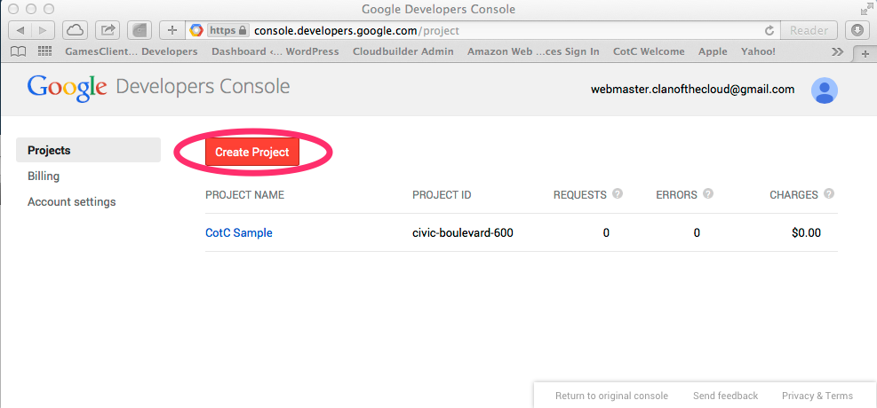
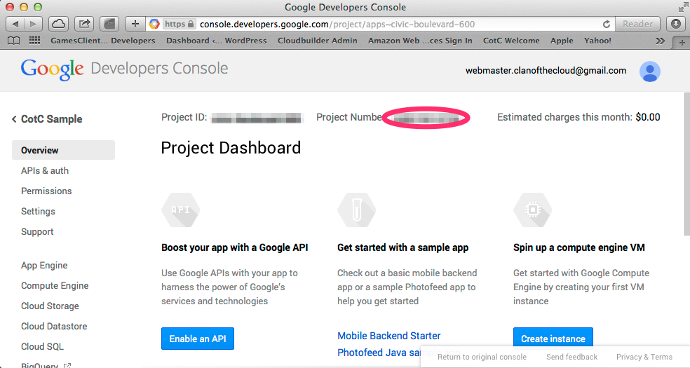
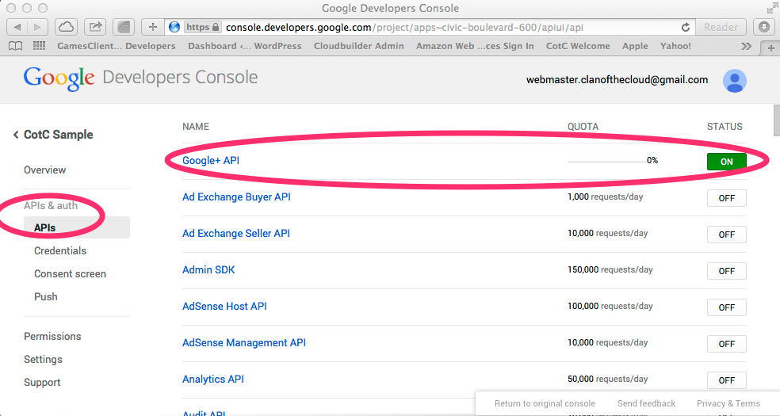
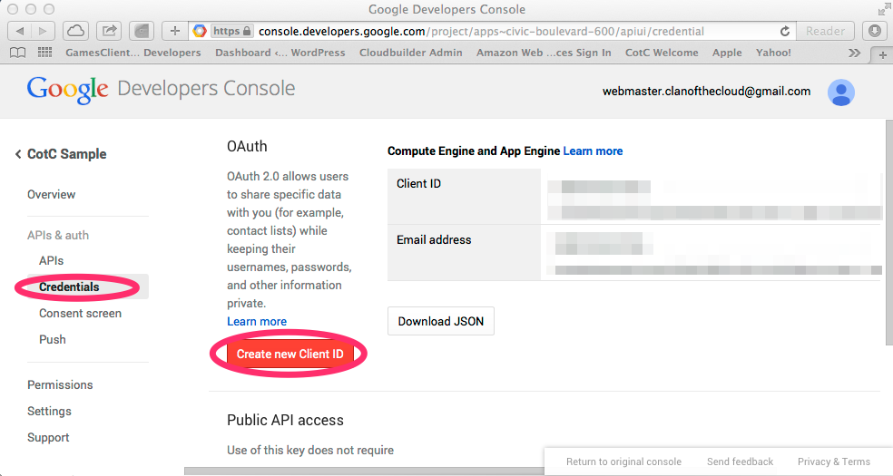
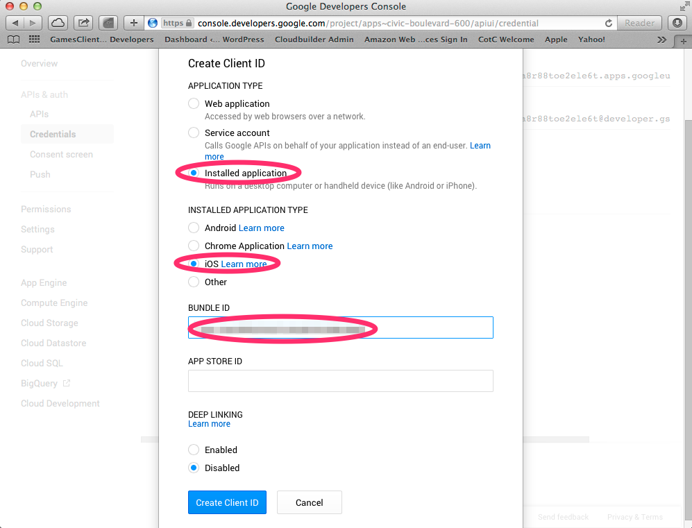
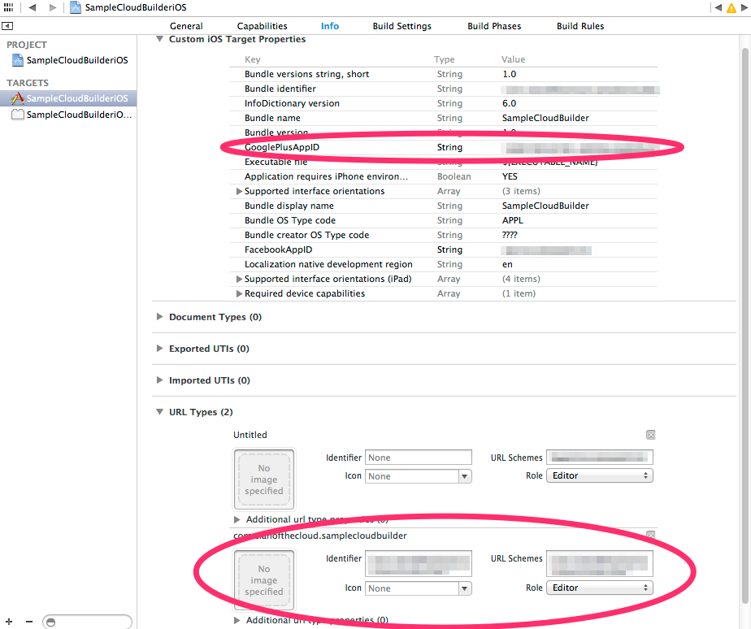
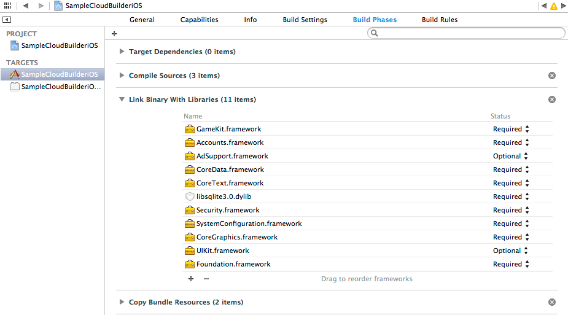
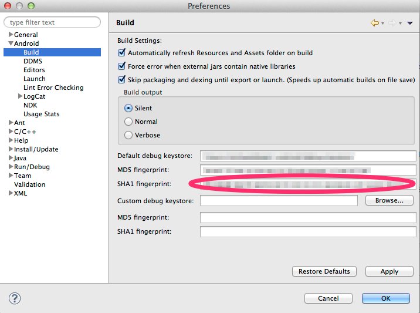
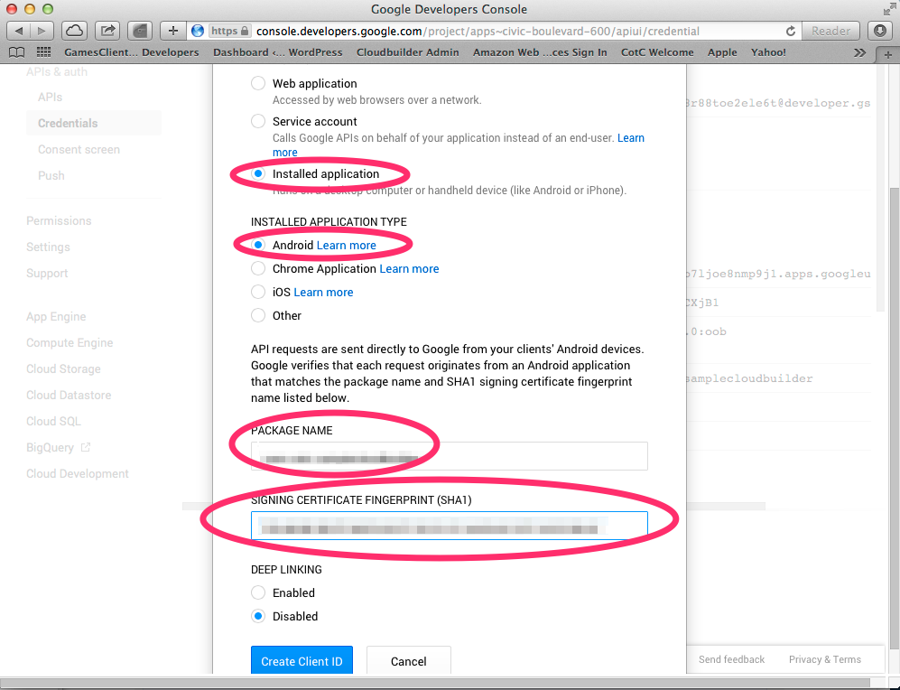
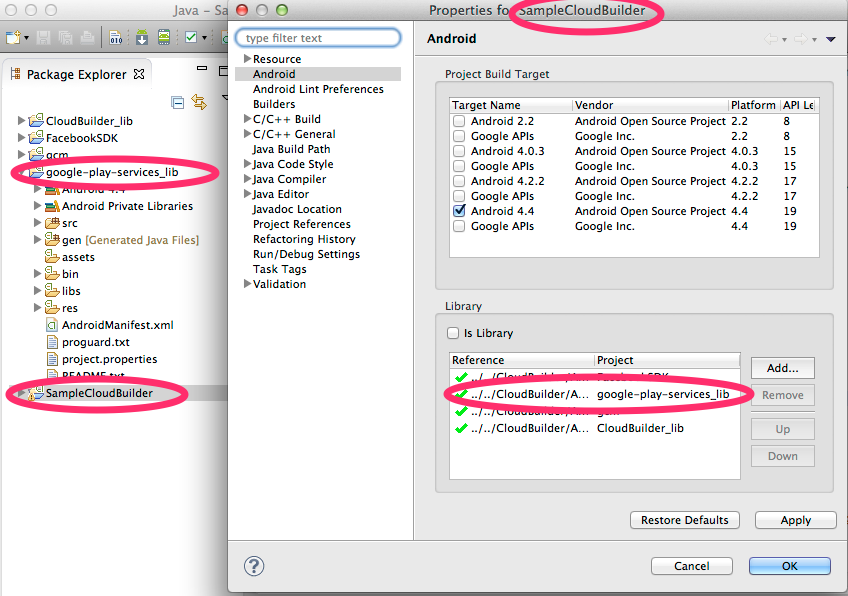

Google+ Settings {#googleplus_ref}
===========

## Table of Content

1. [Google+ Developer](#gp_toc1)
2. [Google+ on iOS](#gp_toc2)
3. [Google+ on Android](#gp_toc3)

# Setup a Google+ App {#gp_toc1}

To be able to log in CloudBuilder with the user's Google+ account, you need to create a [Google+ App](https://console.developers.google.com)

Here, you need to create a new project from the Developers Console. Just push the "Create" button, then choose a name for your project, and you're good to go.

Once the project is created, it will appear in the list of your managed projects and you can click on it. This will display the overview of the project, giving you the Project Number you will have to reference in your different applications.

From the overview, you now need to activate the Google+ API. From the left menu of the overview, press "APIs & auth" and in the sub section "APIs", make sure to activate the "Google+ API". Your application is now authorized to use Google+ single sign on.

When done, you now just need to create new Client IDs for iOS and Android, using the OAuth section. You can access it from the "APIs & auth" left menu, "Credentials" sub section.

# Google+ on iOS {#gp_toc2}

To finish creating an iOS Client ID, in the popping window, choose "Installed application" as APPLICATION TYPE and below INSTALLED APPLICATION TYPE, choose iOS option. Then fill the BUNDLE ID field with the same bundle id used in your iOS application, in the plist file (Bundle identifier entry).

When this is done, look at the Client ID generated for you, and keep it, you will need it now to edit your Xcode project (see below)

Then in Xcode, go to the "Info" section of your project and first create a "GooglePlusAppID" key entry. In the value field, you will copy/paste the Client ID from the previous screen, as generated by Google. Then, you need to create a new "URL Type" entry, just filling "Identifier" and "URL Schemes" fields with your Bundle Identifier. Leave the other fields empty.

It's almost finished. Just check that you have all the necessary frameworks linked to your project by checking the "Build Phases" tab of your project.

Lastly, just ensure that you have the following code in the AppDelegate of your project:
~~~
- (BOOL)application:(UIApplication *)application
            openURL:(NSURL *)url
  sourceApplication:(NSString *)sourceApplication
         annotation:(id)annotation {
    // attempt to extract a token from the url
	if (CClan::Instance() && url)
	{

        CHJSON j;
        j.Put("url", [[url absoluteString ] UTF8String]);
        j.Put("source", [sourceApplication UTF8String]);
        CClan::Instance()->HandleURL(j, new CloudBuilder::CResultHandler(myClan, &MyClan::HandleURLDone));
	}
    
	return false;
}
~~~

# Google+ on Android {#gp_toc3}

You need to get your SHA1 signing certificate fingerprint in order to create a new Android Google+ application. To do so, you have different options.
First option is to type into a terminal the following command:
~~~
keytool -exportcert -alias androiddebugkey -keystore {path-to-debug-or-production-keystore} -list -v
~~~
When debugging you can use '~/.android/debug.keystore' as the path. Then copy the string displayed after the line beginning with 'SHA1: '.
Alternatively, you can use Eclipse to get this SHA1 string. In the menu ADT/Preferences, go to the Android/Build panel and copy the string directly from here.

To finish creating an Android Client ID, in the popping window, choose "Installed application" as APPLICATION TYPE and below INSTALLED APPLICATION TYPE, choose Android option. Then fill the PACKAGE NAME field with the one used to build your APK, and the SIGNING CERTIFICATE with the string retrieved from the previous step.

Then you need to import the Android project {Repository/CloudBuilder/Android/google-play-services-lib} in your Eclipse workspace. When this is done, edit the "Properties/Android" panel of your application inside Eclipse, and add a new Library referencing the GooglePlay Services Library.

To finish the setup of Google+ in your Android application, you need to add some code and modify the ApplicationManifest.xml
Add the following code in the onCreate method of your Activity:
~~~
    protected void onCreate(Bundle savedInstanceState) {
        super.onCreate(savedInstanceState);

        // All your instanciation code is here.

        //  This code to enable Google+ login in Clan of the Cloud
       	GooglePlusHandler.InitGooglePlayServices(this, null);

    }
~~~

Add the following code in the onActivityResult method of your Activity:
~~~
    public void onActivityResult(int requestCode, int resultCode, Intent data) {
    	super.onActivityResult(requestCode, resultCode, data);
    	
        // All your previous code is here.

        //  This code to enable Google+ login in Clan of the Cloud
        GooglePlusHandler.onResultGooglePlusActivity(requestCode, resultCode);
    }
~~~

Add the following entry in the AndroidManifest.xml inside the `<application>` tag:
~~~
<meta-data android:name="com.google.android.gms.version" android:value="@integer/google_play_services_version"/>
~~~
