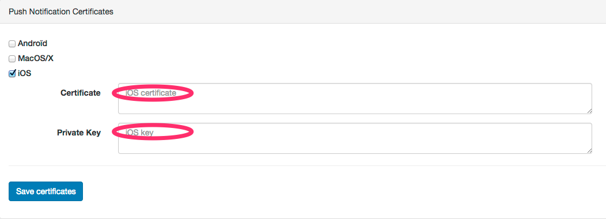
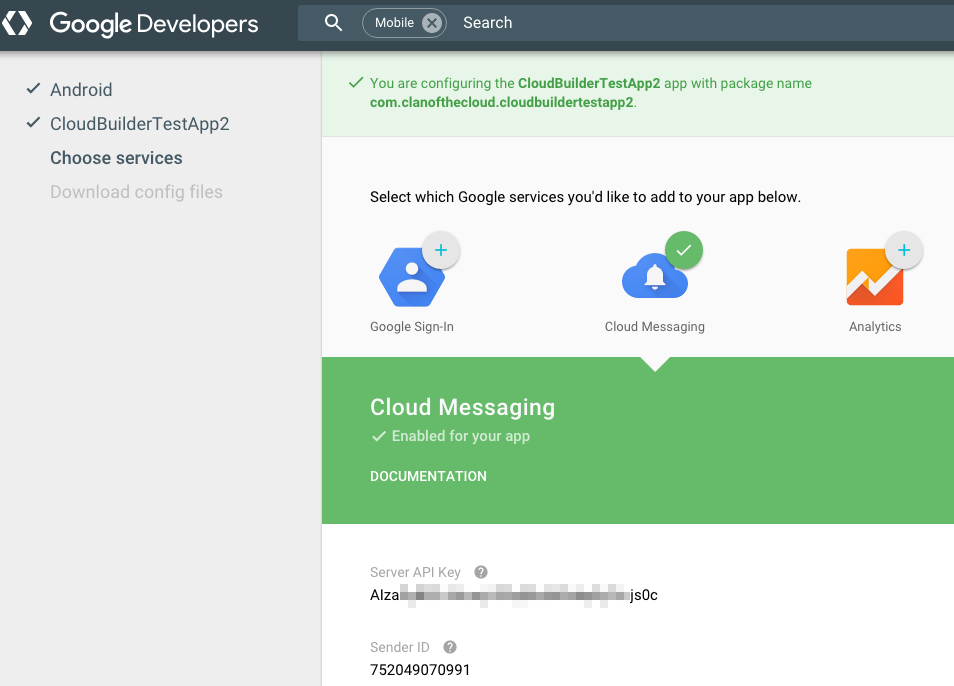

Push Notification {#push_ref}
========

## Table of Content

1. [Push Notification for iOS](#toc_push_1)
2. [Push Notification for Android](#toc_push_2)

   
- - - -

# Setup Notification for iOS {#toc_push_1}

First, setup a certificate with Push notification enabled on [Apple Developer Center](http://developer.apple.com/)

Download it,

and convert it to .pem format with the following command :
~~~
openssl x509 -in certificat.cer -inform DER -outform PEM -out certificat-aps-dev
~~~

You'll also need to convert the **private** key used to generate this certificate to the .pem format. To do this, you first need to export your private key to p12 format by using the Keychain Access tool on your Mac. Launch Keychain Access and right click on the certificate that you have just downloaded and installed, and select the "Export" option, and then the .p12 format.

Once this is done, just convert your private key to .pem format with the following command:
~~~
openssl pkcs12 -in private_push_key.p12 -out push-key-dev.pem -nodes
~~~

Once you've got your two .pem files, open a web page to your [Back Office web page](https://account.clanofthecloud.com), tick the iOS box inside the the "Push Notification Certificates" in your Status page, and fill respectively the "Certificate" and "Private Key" cells with the contents of the files you just created at the previous step (see above).

Finally, a little piece of code is needed in your AppDelegate.mm file :

~~~
#include "CClan.h"

- (void)application:(UIApplication *)application didRegisterForRemoteNotificationsWithDeviceToken:(NSData *)deviceToken
{
	CloudBuilder::AchieveRegisterDevice(deviceToken.length, deviceToken.bytes);
}

- (void)application:(UIApplication *)application didFailToRegisterForRemoteNotificationsWithError:(NSError *)error 
{
    NSLog(@"Error in registration. Error: %@ : %@", error, [error localizedDescription]); 
} 

// Handle an actual notification
- (void)application:(UIApplication *)application didReceiveRemoteNotification:(NSDictionary *)userInfo
{
	// ...

    // this one is needed to reset the bagde number on the App Icon
    application.applicationIconBadgeNumber = 0;
}
~~~
   
- - - -

# Setting up notifications for Android (GCM) {#toc_push_2}

In case you need some more information about how Google Cloud Messaging works, please have a look at the [official Google documentation](https://developer.android.com/google/gcm/gcm.html). Otherwise, by following the steps below, you should be able to have your application manage push notifications pretty quickly.

First, you need to setup a Google Application. Since this is changing quite rapidly at the time of writing, please follow the previous guide for information on how to do it. Once this is done, this Google Application needs to reference the Google Cloud Messaging for Android API. This is done from the APIs section of the Google Developer Console for your project.

In case you are using the new interface, it may look more like the following capture. In this case, when following the instructions above, follow the page [add Cloud Messaging to your existing app](https://developers.google.com/cloud-messaging/android/client) and click on the button "Get a configuration file". Then you need to input information about your application (remember to sign in with your Google Developer account first). In the next screen you will obtain everything needed to set up GCM: the API key to set in the backoffice and the sender ID to set in the manifest.

Next step is to create a Public API key. To do so, select the Credentials section, just below the APIs section in the previous step, scroll down to the bottom of the page, and click the "Create new Key" button for the Public API access list of keys. Then select "Server key" option, and then "Create", not modifying anything. You should now have a new, valid API key.

Once this is done, you're almost finished with parameterization, and only some bits of code will be needed. But first, you need to declare your Google Application with Clan of the Cloud through your [Back Office web page](https://account.clanofthecloud.com). Now it's straightforward. Just tick the Android box inside the "Push Notification Certificates" in your Status page, and fill the "senderID" cell with the Google Application project number, and the "apiKey" cell with the key you just created at the previous step (see above).

Now everything's been done on the Google Application side, we need to add a few snippets of code, so your application can communicate with the Google Cloud Messaging servers. First thing to modify is your AndroidManifest.xml, which is located under Assets/Plugins/Android. Add the following permissions to your manifest.

~~~~{.xml}
    <uses-permission android:name="com.google.android.c2dm.permission.RECEIVE" />
    <uses-permission android:name="android.permission.WAKE_LOCK" />
~~~~

Also add the following line to your manifest under the application node. Replace the value with your GCM sender ID.

~~~~{.xml}
	<meta-data android:name="cotc.GcmSenderId" android:value="\ 123456789012" />
~~~~

Also under the application node, add the following entries:

~~~~{.xml}
    <receiver
        android:name="com.google.android.gms.gcm.GcmReceiver"
        android:exported="true"
        android:permission="com.google.android.c2dm.permission.SEND" >
        <intent-filter>
            <action android:name="com.google.android.c2dm.intent.RECEIVE" />
            <category android:name="com.clanofthecloud.sampleunityproject" />
        </intent-filter>
    </receiver>
    <service android:name="com.clanofthecloud.cloudbuilder.pushnotifications.CotcInstanceIDListenerService" android:exported="false">
        <intent-filter>
            <action android:name="com.google.android.gms.iid.InstanceID" />
        </intent-filter>
    </service>
    <service android:name="com.clanofthecloud.cloudbuilder.pushnotifications.RegistrationIntentService" android:exported="false">
    </service>
~~~~

You also need to implement a service on your own, that will listen for and handle push notifications. As such, you will need an entry such as the following under the application node.

~~~~{.xml}
    <service android:name="com.clanofthecloud.cloudbuildertestapp2.MyGcmListenerService" android:exported="false">
        <intent-filter>
            <action android:name="com.google.android.c2dm.intent.RECEIVE" />
        </intent-filter>
    </service>
~~~~

The class may (minimalistically) look like follows, but you are free to customize it to your liking.

~~~~{.java}
public class MyGcmListenerService extends GcmListenerService {
    private static final String TAG = "MyGcmListenerService";

    int getNotificationIcon() { return android.R.drawable.ic_notification_overlay; }
    int getNotificationId() { return 0; }
    String getNotificationTitle() { return "CloudBuilder test app notification"; }
    Intent getIntent(Context context) { return new Intent(context, MainActivity.class); }

    /**
     * Called when message is received.
     *
     * @param from SenderID of the sender.
     * @param data Data bundle containing message data as key/value pairs.
     *             For Set of keys use data.keySet().
     */
    @Override
    public void onMessageReceived(String from, Bundle data) {
        String message = data.getString("message");
        Log.d(TAG, "Received a message from: " + from + " with content: " + message);
        sendNotification(message);
    }

    /**
     * Create and show a simple notification containing the received GCM message.
     *
     * @param message GCM message received.
     */
    private void sendNotification(String message) {
        Intent intent = getIntent(this);
        intent.addFlags(Intent.FLAG_ACTIVITY_CLEAR_TOP);
        PendingIntent pendingIntent = PendingIntent.getActivity(this, 0 /* Request code */, intent,
            PendingIntent.FLAG_ONE_SHOT);

        try {
            Uri defaultSoundUri = RingtoneManager.getDefaultUri(RingtoneManager.TYPE_NOTIFICATION);
            NotificationCompat.Builder notificationBuilder = new NotificationCompat.Builder(this)
                .setSmallIcon(getNotificationIcon())
                .setContentTitle(getNotificationTitle())
                .setContentText(message)
                .setAutoCancel(true)
                .setSound(defaultSoundUri)
                .setContentIntent(pendingIntent);

            NotificationManager notificationManager =
                (NotificationManager) getSystemService(Context.NOTIFICATION_SERVICE);
            notificationManager.notify(getNotificationId(), notificationBuilder.build());
        } catch (Exception e) {
            Log.w(TAG, "Failed to handle push notification", e);
        }
    }
}
~~~~

That's it, you're done and can now begin to send push notifications to your Android application!